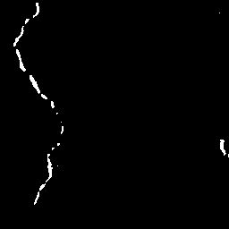

## 📦 Dataset

Uses a subset of **SDNET2018** datasets, which contain:
- Concrete surfaces from **bridge decks**, **pavements**, and **walls**.  
- Labeled as *cracked* or *non-cracked*. 
- We utalized that dataset for Crack segmentation 

Only a 3000 images are used, 2400 for training, 480 for validation and 600 for testing. Image size of 256×256 crops are needed for training and demonstration.

**Folder structure after preprocessing:**
````
data/
├─ raw/ # original dataset (not uploaded)
├─ images/ # 256x256 training crops (mixed cracked/non-cracked)
├─ masks/ # binary crack masks
├─ test_images/ # unseen test images
└─ test_masks/ # optional ground-truth masks for evaluation
````

## Pre-processing

All scripts are in the `scripts/` directory.

### 1 Crop raw dataset
Create 256x256 tiles from raw images:
```bash
python scripts/make_crops.py --raw data/raw --out data/images --size 256 --stride 256
```

### 2 Auto-generate crack masks
Rough crack masks via Canny edges + morphology:
```bash
python scripts/auto_masks.py --images data/images --out data/masks 
```


### 3 Model training
Train the lightweight segmentation model:
```bash
python -m tinycrack.train --images data/images --masks data/masks  --epochs 80 --batch 8 --alpha 0.5 --save outputs/runs/
```

### 4 Inference
``` bash
python -m tinycrack.infer --weights outputs/runs/tc1/weights.pt  --images data/test_images --out outputs/samples

```

### 5 Post-processing 
``` bash
python -m tinycrack.post --preds outputs/samples  --metric_csv outputs/samples/metrics.csv --thr 0.5

```

## Results (sample)


| Original | Probability | Mask | Skeleton |
|-----------|-------------|------|-----------|
|  |  |  |  |


## Training Log

See the full log here:  
➡️ [training_log.txt](outputs/runs/tc1/training_log.txt)